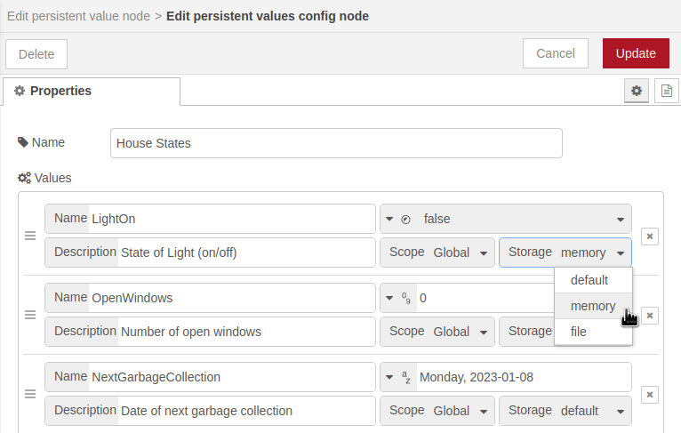

# Nodes for user-friendly use of the Node-RED context stores.

[](https://nodered.org)
[](https://badge.fury.io/js/@waldbaer%2Fnode-red-persistent-values)
[](https://opensource.org/licenses/MIT)
[](https://github.com/waldbaer/node-red-persistent-values/issues)
[](https://github.com/waldbaer/node-red-persistent-values/actions/workflows/node.js.yml)
[](https://coveralls.io/github/waldbaer/node-red-persistent-values?branch=master)

A user-friendly abstraction of the Node-RED context stores.

The idea behind persistent values is the user-friendly abstraction of the Node-RED core
[context functionality](https://nodered.org/docs/user-guide/context).
Instead of using a string name to access the context storage a central configuration node with
all known persistent values is used.

The persistent values itself can then be comfortably accessed with nodes just referencing the central
configuration and the persistent value to be accessed.

Persistent values are typically states, configuration options etc. which shall survice a restart of Node-RED.

# Key Features

- Central configuration of all known persistent values (states, config options, ...).
  - Dataypes: Bool, Number, String
  - Default value
  - Scope and Storage type
- Node to read and write a concrete persistent value referenced via the config.
- Configurable `msg` property for input of new persistent value or output of the current value.
- Configurable `msg` property for output of previous persisted value.
- Append the current persistent value as object attribute to an configurable `msg` property.
- Block further flow processing (no output) if the current value matches with a configured rule.

# Installation
You can install the nodes using the Node-RED 'Manage palette' in the side bar.


Or run the following command in the root directory of your Node-RED installation

```
npm install @waldbaer/node-red-persistent-values
```
[](https://www.npmjs.com/package/@waldbaer/node-red-persistent-values)


# Changelog
Changes can be followed [here](/CHANGELOG.md).

# Usage

## Introduction

1) Add all necessary values to be persisted (states, config options, ...) to one or multiple configuration nodes.

   

2) Select the desired configuration and value for read / write operations.

   

3) Read, write or collect the persistet values in your flows!

   


## Examples
See folder [/examples](/examples) or via Node-RED -> Import -> Examples.
